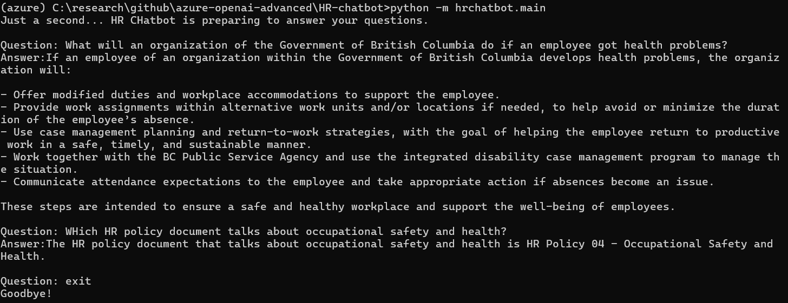

## Prepare data for HR chatbot
Please download the HR policy documents of the Government of British Columbia from this link:  
https://www2.gov.bc.ca/gov/content/careers-myhr/managers-supervisors/employee-labour-relations/conditions-agreements/policy/hr-policy-pdf

Put these documents under the data/documents folder.

## Run HR Chatbot
```
python -m hrchatbot.main
Enter your question.
Enter exit if you want to exit the conversation.
```

## Sample questions and answers
  
1. What will an organization of the Government of British Columbia do if an employee got health problems?  
2. Which HR policy document talks abpout occupational safety and health?


